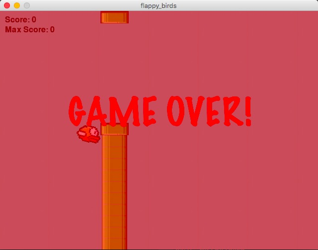

# Flappy Bird Game
An implementation of the popular game Flappy Bird

## Usage
Dependency: pygame, numpy
Install requirement `pip install -r requirements.txt`   
Just run `python Flappy_bird.py` to run the game

Press 'R' to reset the game  
Press 'P' to pause/resume the game 
Press '1','2','3' to change background music 

## Description
This game includes 3 modules `Flappy_Bird,bird and pipe` 
`Flappy_bird` is used to draw the game board, display the score and listen to keyboard event  
`Bird` manages the birds motion and update its coordinates  
`Pipe` including `pipe_head` and `pipe_body`, and it is used to update pipe coordinates